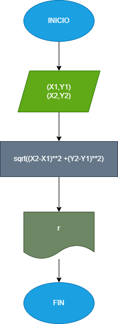

# Calcular la magnitud de un vector

## Para este ejercicio tenemos que pedirle al usuario que nos ingrese las coordenadas de el vector el cual van a estar asocciadas con una posiciòn inicial  en el eje x y una en el eje y,tambièn es necesario ingresar la posiciòn final,despues mediante la formula que se tiene para calcular la magnitud de un vector vamos a obtener la respuesta.

# Diagrama de flujo
